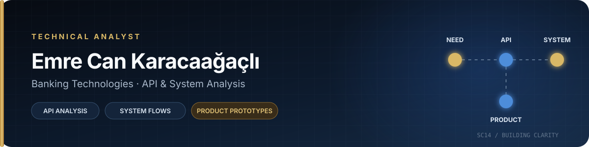

<!-- Scourge14 · Reliable GitHub Profile README -->

  

  <strong>Technical Analyst · Banking Technologies · API & System Analysis</strong>

  İş ihtiyaçlarını teknik netliğe, sistem akışlarını uygulanabilir çözümlere dönüştürüyorum.

  <a href="https://scourge14.github.io/Scourge14WebSite/"><kbd>PORTFOLYO ↗</kbd></a>
  &nbsp;
  <a href="https://www.linkedin.com/in/emre-can-karacaa%C4%9Fa%C3%A7l%C4%B1-650945264/"><kbd>LINKEDIN ↗</kbd></a>
  &nbsp;
  <a href="https://github.com/Scourge14?tab=repositories"><kbd>TÜM PROJELER ↗</kbd></a>

Profil

Bankacılık teknolojileri alanında; gereksinim analizi, REST API entegrasyonları, servis akışları, teknik dokümantasyon ve test senaryoları üzerine çalışıyorum. Teknik analiz bakış açımı modern frontend teknolojileriyle birleştirerek fikirleri çalışan ve test edilebilir prototiplere dönüştürüyorum.

Profesyonel çalışmalarımın önemli bölümü bankacılık ortamlarında ve özel sistemlerde yürütülüyor. Bu profil; paylaşılabilir ürün prototiplerimi, arayüz çalışmalarımı ve teknik yaklaşımımı bir araya getiriyor.

<table>
  <tr>
    <td width="33%" valign="top">
      <h3>01 · ANALYZE</h3>
      
İş ihtiyacını, sistem davranışını ve servis bağımlılıklarını netleştiririm.

    </td>
    <td width="33%" valign="top">
      <h3>02 · MODEL</h3>
      
API sözleşmelerini, iş kurallarını, hata akışlarını ve test senaryolarını modellerim.

    </td>
    <td width="33%" valign="top">
      <h3>03 · PROTOTYPE</h3>
      
Teknik çıktıyı anlaşılır, test edilebilir ve kullanıcı odaklı prototipe dönüştürürüm.

    </td>
  </tr>
</table>

Sistem Yaklaşımım

flowchart LR
    A["İş ihtiyacı"] --> B["Sistem analizi"]
    B --> C["API ve entegrasyon"]
    C --> D["Test senaryoları"]
    D --> E["Kullanılabilir prototip"]

Yetkinlik Haritası

Alan

Ürettiğim teknik çıktı

API & Sistem Analizi

Endpoint, request/response, iş kuralı, hata senaryosu ve servis bağımlılığı analizi

Teknik Dokümantasyon

Use case, akış diyagramı, entegrasyon notları, kabul kriterleri ve ortak teknik dil

Test & Doğrulama

Fonksiyonel test, regresyon, UAT senaryoları ve uçtan uca akış kontrolü

Ürün Prototipleme

Mobil uyumlu web arayüzleri, dashboard yapıları ve çalışan ürün fikirleri

Araçlar & Teknolojiler

  <code>Azure DevOps</code>
  <code>Postman</code>
  <code>Swagger</code>
  <code>REST API</code>
  <code>JSON</code>
  <code>SQL Server</code>
  <code>UAT</code>
  <code>Regression</code>

  <code>Flutter</code>
  <code>Dart</code>
  <code>React</code>
  <code>TypeScript</code>
  <code>JavaScript</code>
  <code>HTML</code>
  <code>CSS</code>
  <code>GitHub Pages</code>

Seçili Projeler

<table>
  <tr>
    <td width="50%" valign="top">
      <h3><a href="https://github.com/Scourge14/Scourge14WebSite">Scourge14WebSite</a></h3>
      
Teknik analiz ve bankacılık teknolojileri odağındaki kişisel portfolyo.

      
<code>Flutter</code> <code>Dart</code> <code>GitHub Pages</code>

      <a href="https://scourge14.github.io/Scourge14WebSite/"><kbd>CANLI DEMO ↗</kbd></a>
    </td>
    <td width="50%" valign="top">
      <h3><a href="https://github.com/Scourge14/ChawaiiArcana">ChawaiiArcana</a></h3>
      
Backend gerektirmeden çalışan, mobil uyumlu ve veri odaklı tarot deneyimi.

      
<code>React</code> <code>TypeScript</code> <code>Vite</code> <code>Tailwind</code>

      <a href="https://github.com/Scourge14/ChawaiiArcana"><kbd>REPOYU AÇ ↗</kbd></a>
    </td>
  </tr>
  <tr>
    <td width="50%" valign="top">
      <h3><a href="https://github.com/Scourge14/WW-Collections">WW Collections</a></h3>
      
Fotoğraf filtrelerini tarayıcıda deneyip PNG çıktısı üreten hafif araç.

      
<code>JavaScript</code> <code>Browser APIs</code> <code>HTML/CSS</code>

      <a href="https://github.com/Scourge14/WW-Collections"><kbd>REPOYU AÇ ↗</kbd></a>
    </td>
    <td width="50%" valign="top">
      <h3><a href="https://github.com/Scourge14/CoffeeWhells">CoffeeWhells</a></h3>
      
Kahve markaları için modern ve responsive landing page prototipi.

      
<code>HTML</code> <code>CSS</code> <code>JavaScript</code>

      <a href="https://github.com/Scourge14/CoffeeWhells"><kbd>REPOYU AÇ ↗</kbd></a>
    </td>
  </tr>
</table>

2026 Odağım

API akışlarını daha görünür ve test edilebilir hale getiren analiz çıktıları

Release sonrası kritik servis akışları için regresyon senaryoları

Teknik ekiplerle iş birimleri arasındaki iletişimi sadeleştiren araçlar

Modern frontend yapılarıyla hızlı ve kullanıcı odaklı ürün prototipleri

  <strong>Bir iş ihtiyacını birlikte teknik netliğe dönüştürelim.</strong>

  <a href="https://scourge14.github.io/Scourge14WebSite/">Portfolyo</a>
  ·
  <a href="https://www.linkedin.com/in/emre-can-karacaa%C4%9Fa%C3%A7l%C4%B1-650945264/">LinkedIn</a>
  ·
  <a href="https://github.com/Scourge14?tab=repositories">Tüm Projeler</a>

